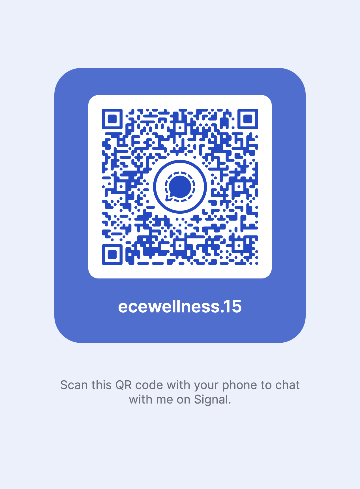

# ECE Wellness

{: .note }
This site is not sanctioned and/or approved by the university. It is a student initiative.

Hi there. I'm Aiden.

I'm the University of Waterloo's ECE2026 wellness representative for the Spring 2024 term.

My job is to work wit

## What concerns do we handle?

## Want to know when my next scheduled meeting is?

You can view the calendar [as a webpage](https://outlook.office365.com/owa/calendar/bdf8cd3f29a6436693acdf7d3e5a836d@uwaterloo.ca/140908a0e9a444c4be2bd53010e966fd15848364299214247537/calendar.html).

Tech savvy users can directly import the [iCal/.ics link](https://outlook.office365.com/owa/calendar/bdf8cd3f29a6436693acdf7d3e5a836d@uwaterloo.ca/140908a0e9a444c4be2bd53010e966fd15848364299214247537/calendar.ics) to their calendar to subscribe.

## Want to send me a note / comment / concern?

You can fill out this [Microsoft survey](https://forms.office.com/r/fP48b34BX8). It is as anonymous as I can make it.

{: width="250" }

## Want to talk anonymously?

You can [message me on Signal](https://signal.me/#eu/id2XJDPw4gdtD8Avvs25yJVuUbKS7bpg8SvXd1WhPyg_sqVFt2NGe7XpMB9uN38k).

{: width="250" }

You will be completely anonymous to me. From there you can discuss your needs and I can help with resources.

## Who is the wellness coordinator?

Kora Sevo.

{: width="250" }

## Want to set up a visit with the wellness coordinator?

You can email Kora at [ksevo@uwaterloo.ca](mailto:ksevo@uwaterloo.ca).

Her office is in E7 4322. If you would like to call, 519-888-4567 x42107. (Call the number first, then put in the extension.)

Alternatively, you can set up a direct meeting with [this link](https://outlook.office365.com/owa/calendar/bkg-ECEWellnessCoordinator@uwaterloo.ca/bookings/).

### Will I be forced to disclose anything to professors / family / administation?

**No!**

Any notes taken during sessions are encrypted with the pass key only accessible to Kora. There is no requirement for Kora
to disclose that you have had any appointments with her in the past. Administration cannot enquire, unless they have received your
permission.
